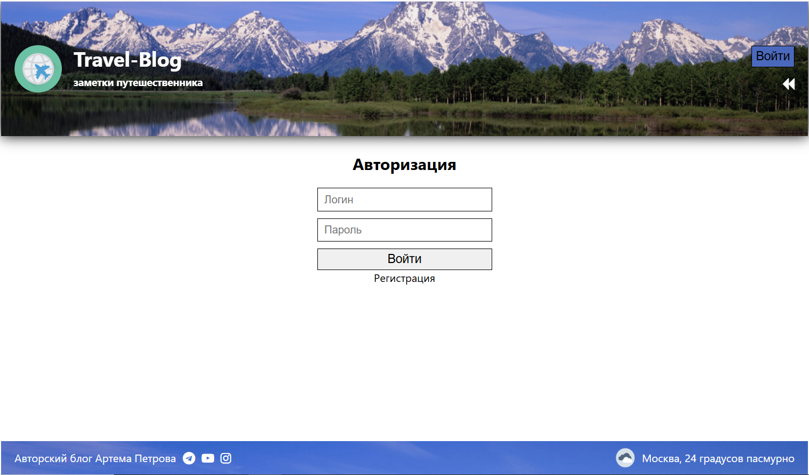

# Travel-Blog (учебный проект)

## Описание проекта

Travel-Blog — это учебный проект блога путешественника. Пользователи могут регистрироваться, входить в систему, создавать посты и оставлять комментарии (только для зарегистрированных пользователей). Редактировать можно только свои посты.

## Функционал

- Регистрация и авторизация пользователей
- Создание, редактирование и удаление постов
- Добавление и удаление комментариев
- Поиск по постам с фильтрацией
- Защищённые маршруты (доступ по ролям)

## Стек технологий

### Backend
- Node.js + Express
- MongoDB (Mongoose для моделей)
- JWT-аутентификация
- REST API
- Валидация данных (validator.js)
- Bcrypt для хеширования паролей
- Docker для развертывания

### Frontend
- React.js (SPA)
- Redux (управление состоянием)
- React Router (навигация)
- Styled Components (стилизация)
- React Hook Form + Yup (валидация форм)
- Адаптивная вёрстка

## Установка и запуск

Создайте файл `.env` в папке `backend` со следующим содержимым:

```env
MONGODB_CONNECTION_STRING=your_mongodb_connection
JWT_SECRET=your_strong_jwt_secret
```

### Запуск через Docker

```bash
docker build -t travel-blog .
docker run -p 3006:3004 -d travel-blog   
```

### Ручная установка

#### Backend

```bash
cd backend
```
```bash
npm install
```
```bash
npm run serve
```

#### Frontend

```bash
cd frontend
```
```bash
npm install
```
```bash
npm run dev
```

## Скриншоты интерфейса





